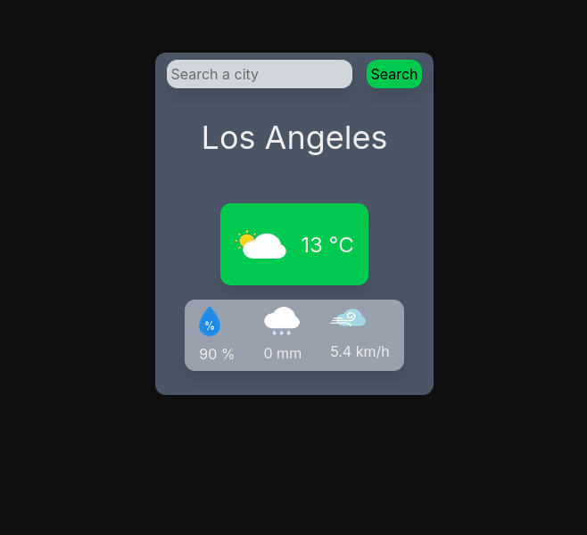

# Simple weather app
Check the weather at whatever city you want!

## Project Description
Project made to my portfolio and to train my proggraming skills. It calls [geocode API](https://nominatim.openstreetmap.org/) with the given city name, then gets latitude and longitude from that API and sends request to 
[weather API](https://open-meteo.com/) and shows the result.

## Used technologies
- NextJS v15.2.0
- Tailwind CSS v4
- Eslint

### Try it out [here](https://simple-weather-app-w5s2-git-main-krecior4s-projects.vercel.app/)!

## Demo

